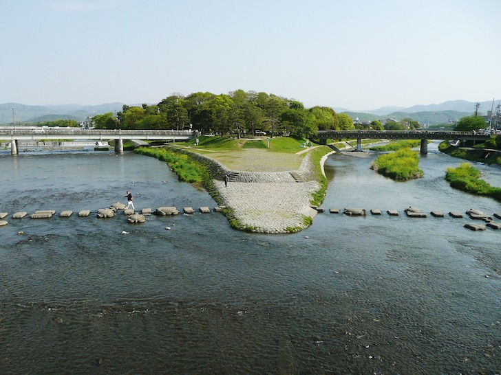

# kamo.js
A library to control event streams on Functional Reactive Programming model.

* [Files](https://github.com/r7kamura/kamo.js#files)
* [API](https://github.com/r7kamura/kamo.js#api)
* [Examples](https://github.com/r7kamura/kamo.js#examples)



(Photo from the [Kamo River](http://en.wikipedia.org/wiki/Kamo_River) in Kyoto Prefecture, Japan)

## Files
```
|--example : Example projects
|--image   : Image files for README
`--src     : Source files written in JavaScript (kamo.js is located here)
```

## API
* [kamo.Stream](https://github.com/r7kamura/kamo.js#new-kamostream)
 * [.fromEventHandlerSetter](https://github.com/r7kamura/kamo.js#fromeventhandlersetterobject-string---stream)
 * [.fromEventHandlerFunction](https://github.com/r7kamura/kamo.js#fromeventhandlerfunctionobject-string-any---stream)
 * [#merge](https://github.com/r7kamura/kamo.js#mergestream---stream)
 * [#scan](https://github.com/r7kamura/kamo.js#scanany-functionany-any---any---stream)
 * [#filter](https://github.com/r7kamura/kamo.js#filterfunctionany---boolean---stream)
 * [#map](https://github.com/r7kamura/kamo.js#mapfunctionany---any---stream)
 * [#combine](https://github.com/r7kamura/kamo.js#combinestream-functionany-any---any---stream)
 * [#sampledBy](https://github.com/r7kamura/kamo.js#sampledbystream-functionany-any---any---stream)
 * [#flatMap](https://github.com/r7kamura/kamo.js#flatmapfunctionany---stream---stream)
 * [#flatMapLatest](https://github.com/r7kamura/kamo.js#flatmaplatestfunctionany---stream---stream)
 * [#throttle](https://github.com/r7kamura/kamo.js#throttleinteger---stream)
 * [#debounce](https://github.com/r7kamura/kamo.js#debounceinteger---stream)

### new kamo.Stream()
kamo.Stream is a class for composable mediator, basically for Pub/Sub messaging model.

```js
var stream = new kamo.Stream();
stream.subscribe(function(value) {
  console.log(value);
});
stream.publish(1);
stream.publish(2);
stream.publish(3);
```

```
1
2
3
```

### .fromEventHandlerSetter(Object, String) -> Stream
Creates a new Stream from an event handler setter of given object.

```js
kamo.Stream.fromEventHandlerSetter(window, 'onkeyup').subscribe(function(event) {
  console.log(event.keyCode);
});
```

```
40
40
38
38
```

```js
// The above example is equal to the following.
(function() {
  var stream = new kamo.Stream();
  window.onkeyup = function(event) {
    stream.publish(event);
  };
  stream.subscribe(function(event) {
    console.log(event.keyCode);
  });
})();
```

### .fromEventHandlerFunction(Object, String, Any...]) -> Stream
Creates a new Stream from an event handler function of given object.

```js
kamo.Stream.fromEventHandlerFunction(window, 'setInterval', 1000).subscribe(function() {
  console.log(1);
});
```

```
1
1
1
```

```js
// The above example is equal to the following.
(function() {
  var stream = new kamo.Stream();
  window.setInterval(
    function() {
      stream.publish();
    },
    1000
  );
  stream.subscribe(function() {
    console.log(1);
  });
})();
```

### #merge(Stream) -> Stream
Creates a new Stream by merging 2 Stream.

```
a          : --1----->
               |
b          : -----2-->
               |  |
a.merge(b) : --1--2-->
```

```js
var a = new kamo.Stream();
var b = new kamo.Stream();
a.merge(b).subscribe(function(value) {
  console.log(value);
});
a.publish(1);
b.publish(2);
```

```
1
2
```

### #scan(Any, function(Any, Any) -> Any) -> Stream
Creates a new Stream as an accumulator from given seed and function.

```
a               : --1--2--3-->
                    |  |  |
a.scan(0, plus) : --1--3--6-->
```

```js
var a = new kamo.Stream();
a.scan(0, function(currentValue, newValue) {
  return currentValue + newValue;
}).subscribe(function(value) {
  console.log(value);
});
a.publish(1);
a.publish(2);
a.publish(3);
```

```
1
3
6
```

### #filter(function(Any) -> Boolean) -> Stream
Creates a new Stream that filters values by given function.

```
a           : --1--2--3-->
                |     |
a.filter(f) : --1-----3-->
```

```js
var a = new kamo.Stream();
a.filter(function(value) {
  return value % 2 == 1;
}).subscribe(function(value) {
  console.log(value);
});
a.publish(1);
a.publish(2);
a.publish(3);
```

```
1
3
```

### #map(function(Any) -> Any) -> Stream
Creates a new Stream that publishes applicaiton results of given function.

```
a        : --1--2--3-->
             |  |  |
a.map(f) : --2--4--6-->
```

```js
var a = new kamo.Stream();
a.map(function(value) {
  return value * 2;
}).subscribe(function(value) {
  console.log(value);
});
a.publish(1);
a.publish(2);
a.publish(3);
```

```
2
4
6
```

### #combine(Stream, function(Any, Any) -> Any) -> Stream
Creates a new Stream that publishes the combination of the latest values.

```
a               : --1-----3----->
                    |     |
b               : -----2-----4-->
                    `--|`-|`-|
a.combine(b, f) : -----3--5--7-->
```

```js
var a = new kamo.Stream();
var b = new kamo.Stream();
a.combine(b, function(aValue, bValue) {
  return aValue + bValue;
}).subscribe(function(value) {
  console.log(value);
});
a.publish(1);
b.publish(2);
a.publish(3);
b.publish(4);
```

```
3
5
7
```

### #sampledBy(Stream, function(Any, Any) -> Any) -> Stream
Like `combine`, but only publishes values when any values are published from given Stream.

```
a                 : --1-----3----->
                      |     |
b                 : -----2-----4-->
                      `--|  `--|
a.sampledBy(b, f) : -----3-----7-->
```

```js
var a = new kamo.Stream();
var b = new kamo.Stream();
a.sampledBy(b, function(aValue, bValue) {
  return aValue + bValue;
}).subscribe(function(value) {
  console.log(value);
});
a.publish(1);
b.publish(2);
a.publish(3);
b.publish(4);
```

```
3
7
```

### #flatMap(function(Any) -> Stream) -> Stream
Creates a new Stream for each value in the soruce stream, using the given map.
The events from all created stream are merged into the result stream.

```
a            : --1---2--------------->
                 |   |
               f(1)------2--3-------->
                     |   |  |
                   f(2)--------4--6-->
                         |  |  |  |
a.flatMap(f) : ----------2--3--4--6-->
```

```js
var a = new kamo.Stream();
a.flatMap(function(value) {
  var eachStream = new kamo.Stream();
  window.setTimeout(
    function() {
      eachStream.publish(value * 2);
      eachStream.publish(value * 3);
    },
    1000
  );
  return eachStream;
}).subscribe(function(value) {
  console.log(value);
});
a.publish(1);
a.publish(2);
```

```
2
3
4
6
```

### #flatMapLatest(function(Any) -> Stream) -> Stream
Like `flatMap`, creates new streams for each source event.
Instead of merging all created streams, it switches between them so that
when a new stream is created, the earlier-created stream is no longer listened to.

```
a                  : --1---2--------------->
                       |   |
                     f(1)------2--3-------->
                           |
                         f(2)--------4--6-->
                                     |  |
a.flatMapLatest(f) : ----------------4--6-->
```

```js
var a = new kamo.Stream();
a.flatMapLatest(function(value) {
  var eachStream = new kamo.Stream();
  window.setTimeout(
    function() {
      eachStream.publish(value * 2);
      eachStream.publish(value * 3);
    },
    1000
  );
  return eachStream;
}).subscribe(function(value) {
  console.log(value);
});
a.publish(1);
a.publish(2);
```

```
4
6
```

### #throttle(Integer) -> Stream
Throttles its stream by given amount of milliseconds.

```
a                   : --1--1--1--1--1-->
                        |     |     |
a.throttle(integer) : --1-----1-----1-->
```

```js
var a = kamo.Stream.fromEventHandlerFunction(window, 'setInterval', 1000).map(function() {
  return 1;
});
a.throttle(1500).subscribe(function(value) {
  console.log(value);
});
```

```
1
1
1
```

### #debounce(Integer) -> Stream
Like `throttle`, but so that event is only published after the given quiet period.

```
a                   : --1---1-------1--------->
                             `-----. `-----.
a.debounce(integer) : -------------1-------1-->
```

```js
var a = kamo.Stream.fromEventHandlerFunction(window, 'setInterval', 1000).map(function() {
  return 1;
});
a.debounce(1500).subscribe(function(value) {
  console.log(value);
});
```

```
1
1
```

## Examples
* [autocomplete](example/autocomplete)
* [konami code](example/konami_code)
